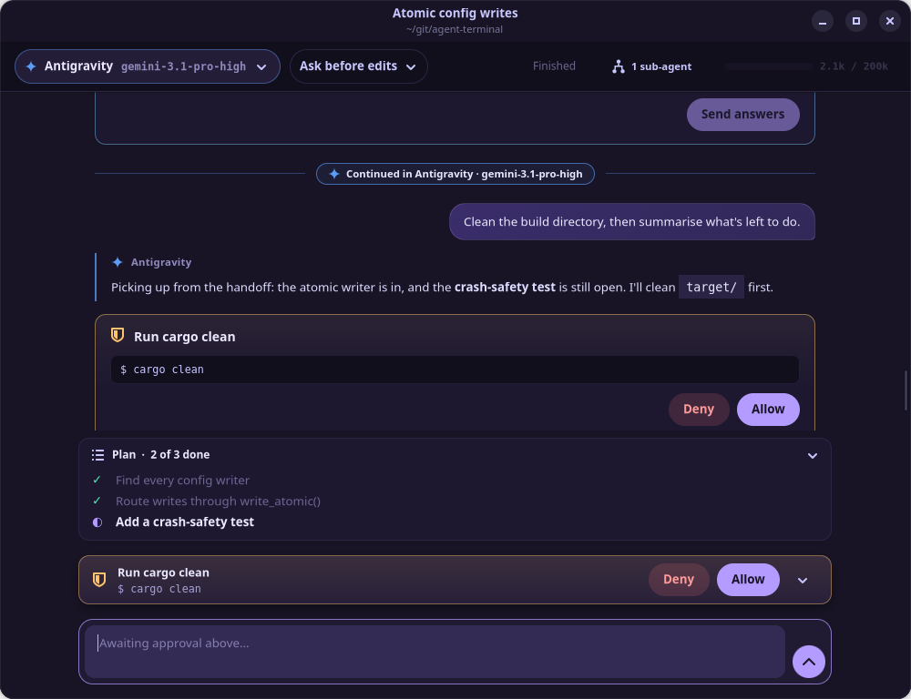
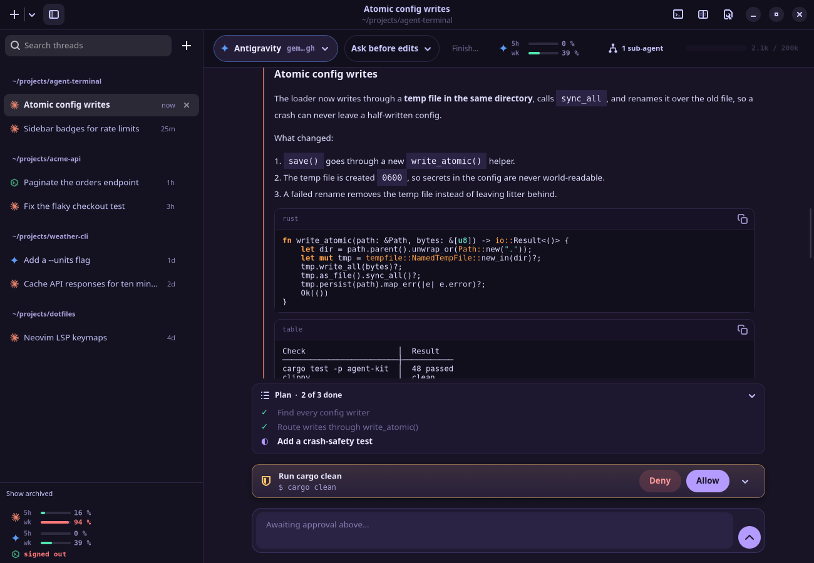
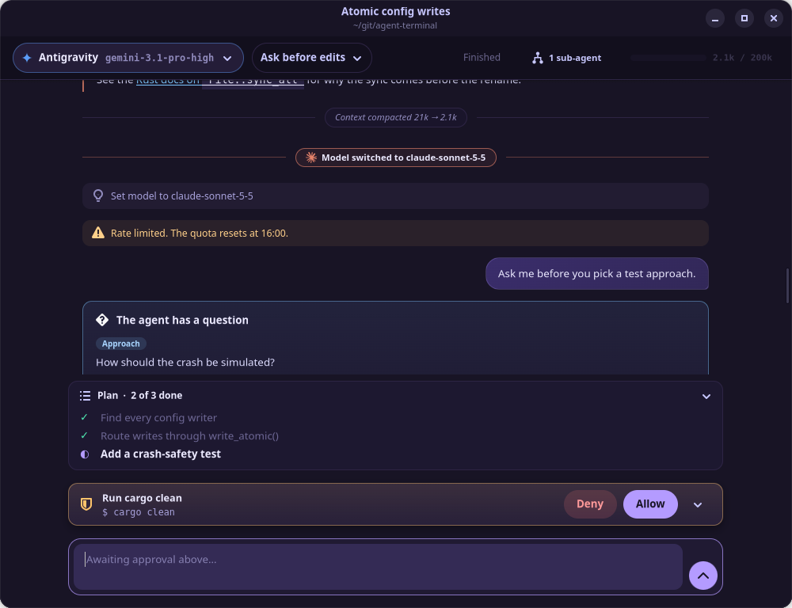
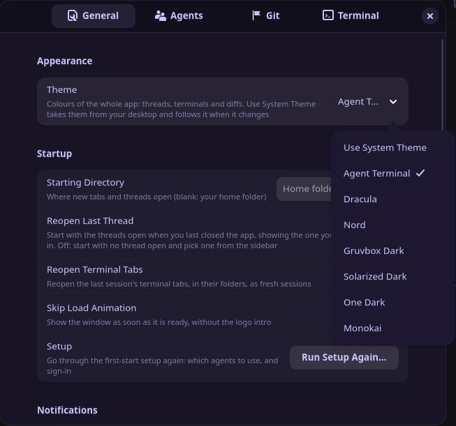
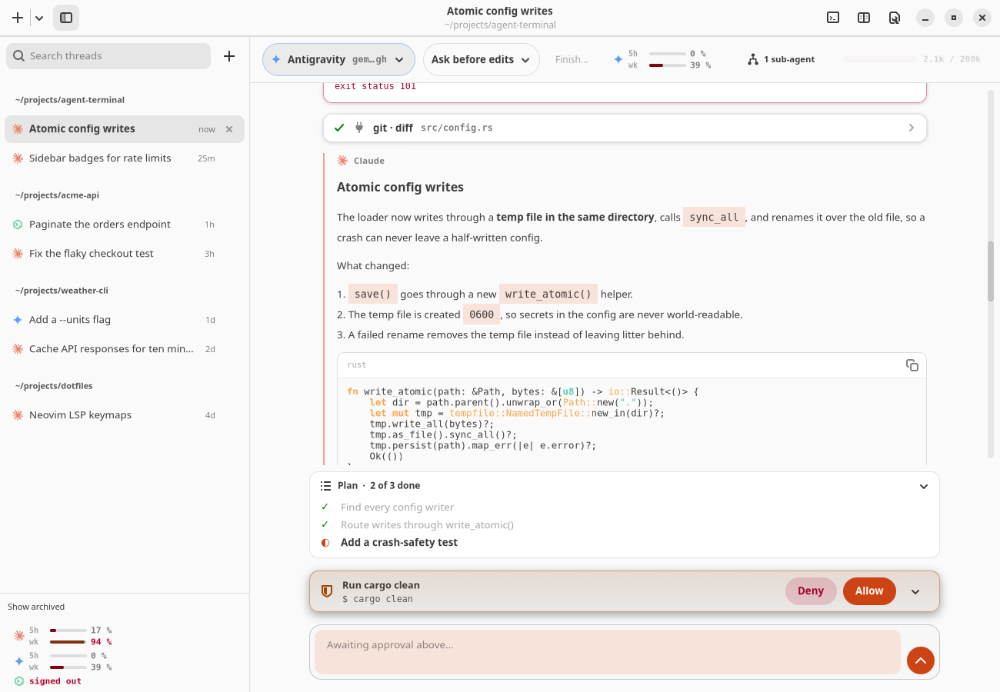
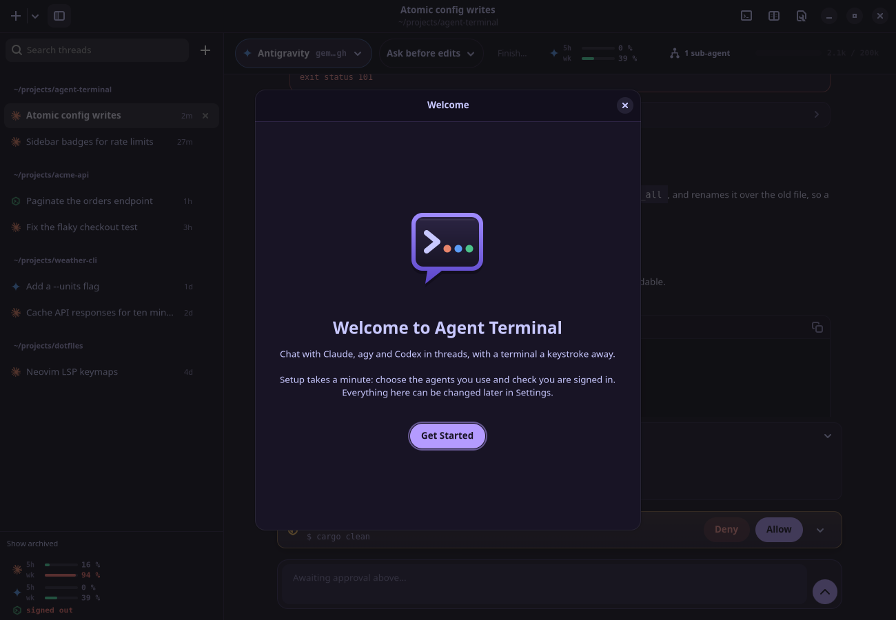

# Agent Terminal

[](https://github.com/jean1880/agent-terminal/actions/workflows/ci.yml)
[](https://github.com/jean1880/agent-terminal/releases)
[](LICENSE)

A native Linux desktop app for working with AI coding agents. Claude Code, Antigravity
(`agy`) and Codex run as chat threads, with approvals, plans, diffs and undo built in.
A terminal is always one keystroke away. It's written in Rust with GTK4 and libadwaita,
and it ships as a single binary.



> Agent Terminal is an independent project, not affiliated with Anthropic, Google or OpenAI.
> It drives their command-line tools, which you install and sign in to yourself.
>
> **Antigravity notice:** Google has previously restricted Antigravity accounts for use
> of third-party tools that bypassed Google's supplied tooling. Agent Terminal uses the
> Google-supplied `agy` CLI rather than bypassing it, but Google has not said whether a
> GUI that drives that CLI is exempt from its third-party-tools rule. Google controls
> enforcement and may change its rules or restrict access at its discretion. Use it only
> if you accept that risk; this project makes no promise that access will remain
> available. See [Google's Antigravity Terms](https://www.antigravity.google/terms) and
> its [account-restriction notice](https://discuss.ai.google.dev/t/update-on-antigravity-tos-ban/131424).

## Contents

- [Highlights](#highlights)
- [Screenshots](#screenshots)
- [Install](#install)
- [Quick start](#quick-start)
- [Features](#features)
- [Command-line options](#command-line-options)
- [Keyboard shortcuts](#keyboard-shortcuts)
- [Configuration](#configuration)
- [Using Antigravity](#using-antigravity)
- [agy's approval hook](#agys-approval-hook)
- [Reference](#reference)
- [Troubleshooting](#troubleshooting)
- [Building from source](#building-from-source)
- [Upgrading](#upgrading)
- [Contributing](#contributing)

## Highlights

- **Switch agents in the middle of a conversation.** A thread isn't tied to one agent.
  Move it from Claude to Antigravity to Codex (and back) whenever you like, from the
  model picker or `/model`. The new agent is handed the conversation so far, and the
  thread keeps one history across all of them. Confirm **Switch and Continue** during
  active work to interrupt the turn and continue with your choice; an idle switch
  sets the model for your next message.
- **One window for three agents.** Claude, Antigravity and Codex threads live in one
  sidebar, grouped by folder and searchable. Claude and agy sessions you already ran
  in those CLIs show up there too.
- **You stay in control.** Inline approvals for commands and edits, a plan panel, and
  questions the agent asks you as cards with answers to pick.
- **Review your multi-agent setup.** One confirmed action opens a review in the exact
  work folder, with a scorecard, skill and MCP recommendations, and an ordered
  improvement guide.
- **Git safety net.** Each turn is checkpointed into hidden refs. The diff panel shows
  what changed, undo puts it back, and a worktree gives an agent its own checkout.
  Your branch, index and stash are never touched.
- **Your desktop, your colours.** The bundled Agent Terminal theme, six classics, or
  **Use System Theme** to follow your desktop's GTK theme, light or dark.

## Screenshots

| | |
|---|---|
|  |  |
| Replies render markdown, code and tables. | Model switches, rate limits, and questions with answers to pick. |
|  |  |
| Themes apply to the whole app, live. | **Use System Theme** on a light desktop. |
|  | |
| A first start walks you through your agents. | |

## Install

Agent Terminal runs on Linux with **GTK 4.10+**, **libadwaita 1.5+**, **VTE 0.72+**
(GTK4 build) and **GtkSourceView 5**. That means Ubuntu 24.04, Debian 13, Fedora 40,
current Arch, or newer.

Packages for each release are attached to the
[GitHub Releases](https://github.com/jean1880/agent-terminal/releases) page.

### Debian / Ubuntu

```bash
sudo apt install ./agent-terminal_<version>_amd64.deb
```

`apt` pulls in the GTK, libadwaita, VTE and GtkSourceView libraries the package needs.

### Fedora

```bash
sudo dnf install ./agent-terminal-<version>-1.x86_64.rpm
```

### Arch Linux

```bash
sudo pacman -U ./agent-terminal-<version>-1-x86_64.pkg.tar.zst
```

### From source

See [Building from source](#building-from-source). Then run `make install` to install
into `~/.local` (binary, icon and desktop entry), and `make uninstall` to remove it.

### The agents themselves

Install and sign in to at least one agent CLI. Agent Terminal finds them on your
`PATH`, in the usual install folders, and through your login shell (so `nvm` and
`asdf` installs work):

| Agent | Command | Get it |
|---|---|---|
| Claude Code | `claude` | [docs.claude.com/claude-code](https://docs.claude.com/en/docs/claude-code) |
| Antigravity | `agy` | [antigravity.google](https://antigravity.google) |
| Codex | `codex` | [github.com/openai/codex](https://github.com/openai/codex) |

## Using Antigravity

Agent Terminal starts the Google-supplied `agy` executable already installed and
authenticated on your machine. It does not reimplement the Antigravity client, proxy
its service, or extract and reuse your Google credentials or OAuth tokens. In other
words, it uses the official CLI rather than trying to bypass it.

Google's current [Antigravity Terms](https://www.antigravity.google/terms) and
[FAQ](https://www.antigravity.google/docs/faq/) place restrictions on using
third-party software, tools or services to access Antigravity and say that violations
can lead to suspension or termination. Google has previously confirmed that it
[restricted accounts for third-party-tool use](https://discuss.ai.google.dev/t/update-on-antigravity-tos-ban/131424),
including tools that used unauthorised OAuth access instead of the supplied CLI.

This integration does **not** take that bypass route. However, Google has not published
a statement that distinguishes a GUI which drives `agy` from a prohibited
"third-party software, tool, or service." We cannot make that decision for Google or
guarantee its enforcement outcome. The integration may work today, but that is not an
approval, assurance of compliance, or guarantee of future availability. Review the
terms yourself and do not use this integration if they do not permit your intended use.

## Quick start

1. **Launch Agent Terminal** from your app menu, or run `agent-terminal`.
2. **The first start opens a short setup.** It shows which agents are installed,
   lets you switch off any you don't use, and offers **Sign In…** for any agent nobody
   is signed in to. It also asks which agent new threads start on. Run it again any
   time from Settings → General → Setup.
3. **Start a thread** with `Ctrl+Shift+T` (or the **+** button). It opens in the
   current folder; **+** → New Thread in Folder… picks another.
4. **Type a request** and press Enter. Use `/` for commands, `@` to mention files and
   `$` for skills. When the agent wants to run a command or edit a file, approve or
   deny it inline. The mode picker in the thread's header switches between
   **Ask before edits**, **Accept edits** and **Plan**.
5. **See and undo changes.** `Ctrl+Shift+D` opens the diff panel. Its undo arrow puts
   the last turn's changes back. `` Ctrl+` `` opens a shell in the thread's folder.
6. **Using agy?** Install its [approval hook](#agys-approval-hook) so it asks before
   it acts.

## Features

### Switching agents mid-conversation

A thread belongs to the work, not to an agent. At any point you can hand it to another one:

- **Pick a model from any agent** in the header chip (or type `/model`). The list covers
  available models from Claude, Antigravity and Codex, with search and effort levels. The same
  agent keeps its native conversation, updating in place or restarting and resuming
  as needed. Choosing another agent carries the conversation into a new session.
- **Switch during active work.** Confirm **Switch and Continue** to interrupt the
  running turn and automatically continue the unfinished task with the selected model.
  Pending approvals and questions are cancelled; the new turn can ask again if needed.
- **Switch while idle.** The session stays idle and uses the selected model for your
  next message. No continuation prompt is sent.
- **See whether the change was accepted.** The header shows the requested model as
  **pending** until the backend acknowledges it. Codex applies model choices on the
  next turn, so an idle selection can remain pending until you send a message.
  Rejected changes show an error and preserve the last accepted choice.
- **The conversation comes with it.** When changing agents, the continuation or your
  next message carries the thread so far, within a token budget: all of it when it
  fits, otherwise the first request and the most recent
  work, and the notice says which ("40 of 112 messages"). It is redacted (keys and tokens
  masked), tool output is shortened and fenced off so it cannot pass for your words, and
  reasoning is not carried. An undelivered handoff survives a restart until the next
  message. A divider marks where the thread changed hands, and each reply is labelled
  with the agent that wrote it.
- **Switch back whenever you like.** Returning to an agent works the same way: a fresh
  session from a summary of the thread, including what the other agent did in between (the
  divider says "Back in Claude · new session from a summary").
- **Safe by default.** A switch while the agent is working asks first. If the new agent
  cannot start (it fails to launch, or exits before its session begins), the thread goes
  back to the old one. Your chosen
  mode carries over and survives a reopen, and an automatic hand-off never lands on
  Antigravity without its approval hook while the thread does not allow unasked edits.
- **Out of quota? Keep going.** When an agent hits its limit, the thread offers
  **Continue in <other agent>**.
- **Fork instead of switching**: `/fork` starts a new thread with this one's history, so
  two agents can take the same problem in different directions.

### Multi-agent environment review

- **Start from the folder you are working in.** Choose **Review Multi-Agent
  Environment…** from the window menu, or a thread's context menu to review that
  thread's folder. Confirm **Start Review** to open a new agent session in that exact
  folder, including nested project folders.
- **A [bundled review skill](assets/skills/multi-agent-environment-review/SKILL.md).**
  The session receives the skill and review instructions
  automatically. It inspects relevant project instructions, agent configuration,
  skills, MCP registrations, permissions, delegation and recovery practices.
  The instructions request a read-only review, with no installations, configuration
  changes or MCP server probes. The selected agent's usual permissions and quota apply.
- **A consistent report in chat.** Seven sections cover scope and evidence, summary,
  scorecard, agent/MCP matrix, skill suggestions, ordered improvements and limits.
  Eight aspects receive evidence-based ratings from **0–5** or **unknown**, with an
  overall score and evidence coverage. Recommendations explain what to change, how
  to verify it, how to undo it and what approval is needed. Configured tools are
  distinguished from tools with demonstrated runtime results.

### Chat threads

- **A sidebar of threads**, grouped by folder and searchable. Each row shows the
  agent, the title, how long ago it was active, and a badge: working, needs approval,
  rate limited or unread. `F9` or `Ctrl+Shift+B` shows or hides it. It overlays the
  thread when the window is narrow. When hidden, its toggle still signals unread
  activity or a thread needing your attention.
- **Your existing sessions.** Recent Claude and agy sessions appear as threads.
  Opening one imports its history and resumes it. (Codex history is not imported yet.)
- **A native transcript**: markdown, code blocks, tool cards, file-change cards with
  their diffs, inline approvals, a plan panel, sub-agent progress, questions with
  answers to pick, and a composer with typeahead.
- **Pending approvals stay within reach.** A panel above the composer keeps approval
  controls available while you scroll, with extra choices in a popover when the
  agent supports them. Pending questions offer a jump back to their answer card.
- **One model picker for every agent.** See
  [Switching agents](#switching-agents-mid-conversation). Models that agy serves on
  Google's quota are marked *via Antigravity*.
- **Usage at a glance.** Each agent's quota windows sit in the thread header and at the
  foot of the sidebar, and update every turn.
- `/rewind` undoes the last turn's changes.

### Git safety net

- **Turn checkpoints**: in a git repository, the working tree is snapshotted into
  hidden refs when a turn ends. Your branch, index and stash stay as they were.
  See [Turn checkpoints](#turn-checkpoints).
- **Diff panel** (`Ctrl+Shift+D`): uncommitted work, the last turn, or everything since
  the thread opened. Open any file in your own diff tool. See [Diff panel](#diff-panel).
- **Undo a turn**, which saves the current state first, so the undo can itself be undone.
  See [Undoing a turn](#undoing-a-turn).
- **Worktrees** (`Ctrl+Shift+G`): a new branch in its own checkout, so an agent can
  work without touching yours. See [Worktree threads](#worktree-threads).

### Terminals

- **Terminal drawer** (`` Ctrl+` ``): your `$SHELL` in the thread's folder, under the
  chat.
- **Terminal threads**: **+** → New Terminal Thread runs any configured CLI in a full
  terminal page, for tools with no chat support (a script, the Gemini CLI). These have
  scrollback search (`Ctrl+Shift+F`), Sixel images and clickable links.
- **A dead session keeps its page.** A CLI that exits with an error leaves its
  scrollback and the error in place, with **Restart** and **Close**.

### Appearance and behaviour

- **Themes**, in Settings → General → Appearance:
  - **Agent Terminal** (default), Dracula, Nord, Gruvbox Dark, Solarized Dark, One Dark
    and Monokai. Each applies live to the whole app: threads, terminals and diffs.
  - **Use System Theme** has no colours of its own. It takes them from your desktop's
    GTK theme (light or dark, its accent colour, any `~/.config/gtk-4.0/gtk.css`) and
    follows it as it changes. Terminals get the desktop's text and background with
    VTE's standard colours.
- **Notifications** when a thread you aren't looking at finishes, needs your approval,
  or runs out of quota. For a terminal thread, the quota notification has a **Continue in…**
  button; a chat thread offers it in the thread itself.
- **Settings apply as you change them**, to every window, and are saved to
  `~/.config/agent-terminal/config.json`. Hand edits to that file are picked up while
  the app runs.
- **Status indicators**: optional header lights driven by a file or a command. See
  [Status indicators](#status-indicators).

## Command-line options

```text
agent-terminal [OPTIONS]
```

| Option | Meaning |
|---|---|
| `-r`, `--resume SESSION_ID` | Open a thread resuming that Claude or agy session, in the folder it was recorded in. |
| `-d`, `--dir DIR` | With `--resume`: resume in `DIR` instead of looking the folder up. |
| `-h`, `--help` | Show the options (`--help-all` adds GTK's own). |
| `--approval-hook` | Internal: agy's approval hook runs this. Not for direct use. |
| `--chat-demo` | Open a window showing a scripted chat, with no agent running. |

To see the whole window with demo threads instead of yours (for screenshots), set
`AGENT_TERMINAL_DEMO_THREADS=1`. It keeps the threads in memory, starts no agent, and leaves
your real thread store alone.

Agent Terminal runs as a single instance. A second launch hands its request to the
window that is already open and exits, so `agent-terminal --resume <id>` opens the
thread in your existing window. A bad ID or folder is reported on the terminal you
ran it from, with exit status 2.

```bash
agent-terminal --resume 215bf7f7-88e4-4070-b41b-332500303534
agent-terminal --resume <id> --dir ~/git/some-project
```

### Environment variables

| Variable | Effect |
|---|---|
| `RUST_LOG` | Log level and filters (default `info`). |
| `XDG_CONFIG_HOME` | Where `agent-terminal/config.json` lives (default `~/.config`). Point it at a scratch folder to run an isolated copy. |
| `XDG_STATE_HOME` | Where the thread store, hand-off briefs and agy's always-allow rules live (default `~/.local/state`). |
| `AGENT_TERMINAL_HOOK_BIN` | The binary agy's approval hook runs (default `agent-terminal` on `PATH`). |
| `AGENT_TERMINAL_DEMO_THREADS` | Set to `1` for demo threads in place of yours (in memory, no agents run). |

## Keyboard shortcuts

| Keys | Action |
|---|---|
| `Ctrl+Shift+T` | New thread |
| `Ctrl+Shift+G` | New thread in a new worktree |
| `Ctrl+Shift+W` | Close the thread |
| `Ctrl+Shift+R` | Restart the session |
| `Ctrl+Shift+O` | New thread in a chosen folder |
| `Ctrl+Shift+E` | Resume an existing session |
| `Ctrl+Shift+S` | Take a checkpoint now |
| `F9`, `Ctrl+Shift+B` | Show or hide the sidebar |
| `` Ctrl+` ``, `Ctrl+J` | Show or hide the terminal drawer |
| `Ctrl+Shift+D` | Show or hide the diff panel |
| `Ctrl+Shift+F` | Search a terminal's scrollback |
| `Ctrl+Shift+C` / `Ctrl+Shift+V` | Copy / paste |
| `Ctrl+,` | Open Settings |
| `Ctrl+?` | Show keyboard shortcuts |
| `Ctrl+Tab`, `Ctrl+Page Down` | Next thread |
| `Ctrl+Shift+Tab`, `Ctrl+Page Up` | Previous thread |
| `Alt+1`…`Alt+8`, `Alt+9` | Go to thread N, or the last one |
| `Ctrl+Alt+1`…`Ctrl+Alt+9` | New terminal thread with the Nth profile, in the current folder |
| `Ctrl+Plus` / `Ctrl+Minus` / `Ctrl+0` | Chat and terminal text zoom in / out / reset (saved); `Ctrl+=` also zooms in |
| `Ctrl+click` | Open a link in a terminal |

These are caught before a terminal sees them, so a CLI never receives them.

## Configuration

Everything in Settings is saved to `~/.config/agent-terminal/config.json`. A few things
can only be set there: profiles, status indicators and the cleared environment.

| File | What |
|---|---|
| `~/.config/agent-terminal/config.json` | Settings, profiles, indicators. Written atomically, `0600`. |
| `~/.local/state/agent-terminal/threads.db` | The thread store (SQLite). Every stored event is redacted. |
| `~/.local/state/agent-terminal/handoffs/` | Hand-off briefs: `0700` folder, `0600` files, pruned after 7 days. |
| `~/.local/state/agent-terminal/always-allow.json` | agy actions you chose to always allow, per folder. |

A settings file that can't be parsed is copied aside (`config.json.invalid-…`) and
reported before defaults replace it. An edit that doesn't parse yet suspends saving
until it is fixed.

### Settings reference

| Key | Default | Meaning |
|---|---|---|
| `theme` | `"agent-terminal"` | `system`, `agent-terminal`, `dracula`, `nord`, `gruvbox-dark`, `solarized-dark`, `one-dark` or `monokai` |
| `starting_directory` | `""` | Where new threads open (blank: your home folder) |
| `default_agent` | none | `claude`, `agy` or `codex` for new threads (none: the first one installed) |
| `profiles` | Claude, Agy, Codex | The CLIs on offer. See [Profiles](#profiles) |
| `default_profile` | none | The profile terminal threads run (none: the first one installed) |
| `checkpoints` | `true` | Snapshot each turn in a git repository |
| `worktree_root` | `""` | Where worktrees go (blank: a hidden folder beside the repository) |
| `diff_tool` | none | The external diff tool for **Open in…** |
| `diffs_expanded` | `false` | Open a file-change card's diff as soon as the edit lands |
| `notify_on_bell` | `false` | Notify when a background thread finishes |
| `notify_on_quota` | `true` | Notify, with a hand-off button, when an agent runs out of quota |
| `reopen_last_thread` | `false` | Start with the threads open at the last close |
| `restore_session` | `false` | Reopen the last terminal threads, as fresh sessions |
| `skip_load_animation` | `false` | Show the window as soon as it is ready |
| `font`, `font_scale` | JetBrains Mono 11, `1.0` | Terminal font and zoom |
| `cursor_shape`, `cursor_blink` | `block`, `true` | Terminal cursor |
| `scrollback_lines` | `10000` | Terminal scrollback |
| `indicators` | `[]` | Header status lights. See [Status indicators](#status-indicators) |
| `turn_command` | none | A command run when a turn ends (`{id}`, `{dir}` are filled in) |
| `clear_env` | session markers | Variables removed from a spawned agent's environment (`*` matches a prefix) |

### Profiles

Profiles define how each CLI is run: the chat agents (Settings → Agents edits these)
and anything you want as a terminal thread. Adding a CLI is a config edit, not a
rebuild:

```jsonc
{
  "profiles": [
    { "name": "Claude",  "command": "claude" },
    { "name": "Codex",   "command": "codex", "args": ["--full-auto"] },
    // Root a profile in a specific project, with its own environment.
    { "name": "Infra",   "command": "claude",
      "dir": "~/git/infra",
      "env_file": "~/.config/agent-terminal/infra.env" }
  ],
  "default_profile": "Claude"   // omit, or null, to use the first one installed
}
```

`env_file` is sourced in a subshell and its *exported environment* merged into the
session. Nothing it prints reaches the terminal, because output before `exec` breaks the
CLI's terminal handshake. Settings → Agents also sets each agent's extra arguments,
environment file, default model, mode and effort, and whether it is enabled.

## agy's approval hook

`--dangerously-skip-permissions` is agy's name for bypassing its built-in terminal
permission prompts. Agent Terminal needs that mode only because it is a GUI: agy's
headless process cannot display and receive its own interactive prompt there. The app
replaces that prompt path with its local approval hook, so each tool request is sent to
the thread and waits for your explicit Allow or Deny response. It is not enabled to
give an agent unasked access to your machine.

Agent Terminal passes this flag **only** when its approval hook is installed in
`~/.gemini/config/hooks.json` and an approval socket is live. That condition is
deliberately strict: if the hook is absent, unavailable, or fails to ask before a tool
step, the session is restarted without the flag. The hook is a safety boundary, not a
way to weaken one.

Without the hook, the mode picker drives agy's own `--mode` flag (Plan or Accept
edits), and **Ask before edits is unavailable**: headless agy has nobody to ask.
Without the skip flag agy refuses shell commands in every mode, but **it applies
file edits in every mode, Plan included** (it writes a plan, then carries it out). The
thread tells you so.

To install the hook, add this entry as a top-level key of
`~/.gemini/config/hooks.json`. Settings → Agents shows the same entry, with a Copy
button and whether it is installed:

```json
{
  "agent-terminal-approval": {
    "PreToolUse": [
      {
        "hooks": [
          {
            "command": "bash -c '[ -n \"$AGENT_TERMINAL_APPROVAL_SOCKET\" ] || exit 0; exec \"${AGENT_TERMINAL_HOOK_BIN:-agent-terminal}\" --approval-hook'",
            "timeout": 600,
            "type": "command"
          }
        ],
        "matcher": ".*"
      }
    ]
  }
}
```

The hook does nothing outside Agent Terminal, because the socket variable is unset
there. The app also checks that the hook really fires: if agy runs a tool without
asking first, the thread is restarted without `--dangerously-skip-permissions`.

## Reference

### Resuming sessions

Resuming is declared per profile, so the binary knows no CLI's conventions:

```jsonc
{ "name": "Claude", "command": "claude",
  "resume_args": ["--resume", "{id}"],          // {id} is the session ID
  "session_store": "~/.claude/projects",        // where <id>.jsonl transcripts live
  "session_title": "/aiTitle" }                 // JSON pointer to a session's title
```

**Resume Session…** opens a browser of the store's 200 most recently active sessions,
newest first. Each row shows the session's title, the folder it will resume in, and
how long ago it was last active. Type to filter by title, folder or ID; Enter resumes
the top match. **Enter ID…** in its header falls back to pasting an ID. Only the first
and last 256 KiB of each transcript are read, so a store of multi-MiB transcripts
still lists quickly. A store that cannot be read says so rather than showing an empty
list.

`session_store` exists because Claude only resumes a session from the project
directory it was recorded in. The transcript is looked up (directly in the store or
one directory down) and its first recorded `cwd` becomes the thread's directory. If it
can't be found, the thread opens in the profile's default directory and a dialog
explains how to pass `--dir`.

agy keeps one history log instead of a transcript per session, so its profile declares
`"session_format": "agy-history"`. Its sessions are titled by their first prompt and
resumed with `--conversation <id>` in the workspace they were recorded in. Only the
last 4 MiB of the log is read.

Claude and agy profiles saved by an older release are filled in with these settings on
load; so are the hand-off settings below. An explicit empty list, such as
`"resume_args": []`, opts out.

### Handing off between CLIs

For a terminal thread, **Continue In ▸ <profile>** opens one running another CLI in
the same folder, starting with a prompt that points at a *hand-off brief*. The
out-of-quota CLI cannot summarize its own work, so the brief is written from disk:

- the original request, the latest requests, the last reply and the files the session
  edited, from the transcript (agy's log records requests only);
- `git status`, `git diff HEAD --stat` and the last five commits;
- the end of the screen, if no transcript can be found.

Briefs are written to `$XDG_STATE_HOME/agent-terminal/handoffs/`. The directory is
`0700`, each file is `0600`, and briefs older than 7 days are pruned. Credentials in
common formats (`ghp_…`, `sk-…`, `AIza…`, `Bearer …`, `*_KEY=…`, `"password": …`, PEM
blocks) are masked as `****` plus their last four characters. The masking works by
pattern, so a secret in an unrecognized format can get through, and each brief says
so.

Quota exhaustion is detected from Claude's transcript (a `rate_limit` error), or by
`limit_markers`, text matched near the bottom of the screen, for a CLI with no such
record:

```jsonc
{ "name": "Agy", "command": "agy",
  "prompt_args": ["--prompt-interactive", "{prompt}"],   // how to start with a prompt
  "limit_markers": ["RESOURCE_EXHAUSTED", "quota exceeded"] },
{ "name": "Claude", "command": "claude",
  "prompt_args": ["{prompt}"],
  "session_id_args": ["--session-id", "{id}"] }          // start under a chosen ID
```

### Status indicators

Optional header-bar lights driven by a file or a command. Empty by default.

```jsonc
{
  "indicators": [
    // Non-empty file contents mean "needs attention"; the contents are the detail.
    { "label": "Config drift",
      "source": { "type": "file", "path": "~/reports/drift.txt" },
      "refresh_secs": 300 },

    // A non-zero exit means "needs attention"; stdout is the detail.
    { "label": "Backups",
      "source": { "type": "command", "argv": ["check-backups", "--quiet"],
                  "timeout_secs": 15 },
      "refresh_secs": 900,
      "action": "show-output" }
  ]
}
```

Each indicator has **three** states, not two: OK, needs-attention, and *unknown*. A
source that cannot be read gets its own icon and says so; it is never quietly reported
as healthy. Commands run off the UI thread and are killed at their timeout.
`"action": "send-to-terminal"` adds a button that types the detail into the running
session, behind a preview.

### Turn checkpoints

In a thread whose folder is inside a git repository, the working tree is snapshotted
each time a turn ends. **Checkpoint Now** takes one on demand. A snapshot that fails
marks the thread with a warning icon, and its tooltip says why.

Snapshots are commits recorded only as refs under `refs/agent-terminal/<thread>/`. They
never touch your branch, index, working tree or stash. Each captures tracked changes
plus untracked, non-ignored files. It leaves out files over 5 MiB, more than 2,000 new
files, nested repositories, and names that look like secrets (`.env*`, `*.pem`,
`*.key`, `id_rsa*`, …). Each thread keeps 50 checkpoints, and any checkpoint older than
7 days is deleted.

A normal `git push` does not send these refs. `git push --mirror`, or a local
`git clone` of the repository, **does**. A dirty submodule's contents, and files
ignored by `.gitignore`, are not captured. Tracked Git LFS files are stored in
`.git/lfs/objects` with no size cap.

Turn it off in Settings → Git (**Checkpoint Each Turn**). To remove every checkpoint
from a repository:

```bash
git for-each-ref --format='delete %(refname)' refs/agent-terminal | git update-ref --stdin
```

### Diff panel

`Ctrl+Shift+D` opens a read-only panel with a file list, line counts and a coloured
unified diff. The dropdown picks what to compare against:

| Base | Shows |
|---|---|
| **Uncommitted** | HEAD against the working tree now, untracked files included |
| **Last turn** | What the thread's latest checkpoint changed |
| **This thread** | Everything since the state the thread's first checkpoint was taken on top of |

The panel refreshes when it opens, when a checkpoint is taken, when the base changes,
and on its refresh button. It never polls. Git's external diff and textconv drivers
are not run. Diffs above 1 MiB or 20,000 lines are cut short. With a diff tool set
(Settings → Git), **Open in…** launches it on any file.

### Undoing a turn

With the diff panel on **Last turn** or **This thread**, the undo arrow puts the
working tree back to the diff's left side. A confirmation lists every file that will
change (`~`) or be deleted (`−`), and warns if the agent still looks busy.

- **The current state is saved first**, as `refs/agent-terminal/<thread>/pre-restore-<time>`,
  and the **Undo** on the "Changes undone" message puts it back.
- **Nothing checkpoints never capture is touched**: ignored files, files over 5 MiB,
  names that look like secrets, nested repositories.
- **Commits and staged changes are never touched.** Only the working tree changes.
- **If a file changes after you open the confirmation**, nothing is restored and you're
  asked to try again, so nothing unsaved can be lost.
- Deletions stay inside the repository and never follow a symlinked folder.
- Afterwards the result is checked against the checkpoint. Anything that still differs
  is reported, with the `git restore` command that puts the saved state back by hand.

### Worktree threads

**New Thread in Worktree…** (`Ctrl+Shift+G`) asks for a new branch and what to start
it from, checks both as you type, then runs `git worktree add -b <branch>` and opens a
thread there.

Worktrees go in a hidden folder beside the repository,
`<parent>/.<repo>.worktrees/<branch>`, so tools that scan every project folder don't
index a second copy. Set **Worktree Folder** in Settings → Git to use
`<folder>/<repo>/<branch>` instead. Ignored files (`node_modules`, `.env`, build
output) aren't copied into a new worktree.

Closing a worktree thread offers **Remove**, but only when the worktree has nothing
uncommitted, no untracked or ignored files, and nothing else open in it. Removal never
uses `--force` and never deletes the branch. To clean up by hand:

```bash
git worktree list
git worktree remove <path>      # refuses if it has changes
git branch -d <branch>          # refuses if it is unmerged
```

## Troubleshooting

**Where are the logs?** In the systemd journal, and on stderr when started from a
terminal:

```bash
journalctl --user -t agent-terminal -b
RUST_LOG=debug agent-terminal
```

**"No AI CLI detected."** None of the configured commands was found on `PATH`, in the
usual install folders, or through your login shell. Install one (see
[The agents themselves](#the-agents-themselves)), or set its full path in Settings →
Agents, then press **Check again**.

**An agent says "Not signed in".** Use **Sign In…** in Settings → Agents (or on the
thread's banner), finish signing in, then **Check Again**.

**agy edits files in Plan mode.** It does, without its approval hook. Install the
[hook](#agys-approval-hook).

**My local build doesn't start / opens the old version.** Agent Terminal is
single-instance. If another copy is running, a new launch hands over to it and exits.
Run a development build on its own session bus:

```bash
dbus-run-session -- ./target/debug/agent-terminal
```

**Settings reset after a hand edit.** The file didn't parse. Your version was kept as
`config.json.invalid-…` beside it, and the app said so when it started.

## Building from source

Requirements: **Rust 1.92+** and the development packages below.

| Distribution / OS | Packages |
|---|---|
| Debian / Ubuntu | `libgtk-4-dev libadwaita-1-dev libvte-2.91-gtk4-dev libgtksourceview-5-dev libglib2.0-dev-bin pkg-config` |
| Fedora | `gtk4-devel libadwaita-devel vte291-gtk4-devel gtksourceview5-devel glib2-devel` |
| Arch | `gtk4 libadwaita vte4 gtksourceview5 pkgconf` |
| macOS (Homebrew) | `brew install gtk4 libadwaita gtksourceview5 pkg-config` |

```bash
git clone https://github.com/jean1880/agent-terminal.git
cd agent-terminal
make deps          # Debian/Ubuntu: install the packages above
make start-local   # build (debug) and run
make build         # release build: target/release/agent-terminal
make install       # into ~/.local (binary, icon, desktop entry)
make package       # a .deb, via cargo-deb
```

### macOS build (MVP)

Agent Terminal can be compiled on macOS without Linux-specific components (`vte4` terminal tabs and systemd `journald` logging):

```bash
brew install gtk4 libadwaita gtksourceview5 pkg-config
cargo build --no-default-features --release
```

All chat thread features, multi-agent switching, approvals, diff panels, and git checkpoints work natively.

Development checks (CI runs the same):

```bash
cargo fmt --all
cargo clippy --workspace --all-targets -- -D warnings
cargo test --workspace
```

### Project structure

- `src/main.rs`: entry point, command-line options, logging, global CSS, shortcuts.
- `src/window/imp.rs`: the window, settings, spawning, terminal pages.
- `src/window/imp/threads.rs`: the thread sidebar, thread pages, terminal drawer.
- `src/window/imp/agents_prefs.rs`, `setup.rs`: Settings → Agents, and the first-start walkthrough.
- `src/chat/`: the chat thread: `session.rs` (adapter, process, store, switching,
  hand-off) and `view/` (transcript, composer, panels, model picker).
- `src/palette.rs`, `src/theme.rs`: app-wide colours (and the system theme), terminal palettes.
- `src/config.rs`: settings, migration and validation.
- `src/agent_proc.rs`, `src/approval_server.rs`, `src/approval_hook.rs`: the agent process
  transport and agy's approval socket and hook.
- `crates/agent-core`: pure logic, with no GTK or I/O: events, the Claude/agy/Codex
  adapters, policies, redaction.
- `crates/agent-kit`: GTK-free I/O: the thread store, git checkpoints, diffs, restore,
  worktrees, hand-off briefs, session readers.

## Upgrading

### From 2.x

- **Chat is the default.** `Ctrl+Shift+T`, **+**, New in Folder, New in Worktree,
  Resume and Continue In open chat threads. **+** → New Terminal Thread gives a 2.x
  terminal page with any profile.
- **Your config keeps working.** The new per-agent settings and the default agent are
  optional, and set in Settings → Agents. The theme moved to Settings → General.
- **Threads are stored** in `~/.local/state/agent-terminal/threads.db`.
- **agy can't ask before acting** until you install its [approval hook](#agys-approval-hook).

### From 1.x (`antigravity-terminal`)

On first launch, settings at `~/.config/antigravity-terminal/config.json` are copied to
`~/.config/agent-terminal/config.json`. The old file is left in place.

## Contributing

1. Branch: `git checkout -b feat/cool-new-thing`.
2. Keep it green: `cargo fmt`, `cargo clippy --workspace --all-targets -- -D warnings`
   and `cargo test --workspace`.
3. Commit using [Conventional Commits](https://www.conventionalcommits.org/).

## License

MIT. See [LICENSE](LICENSE).
